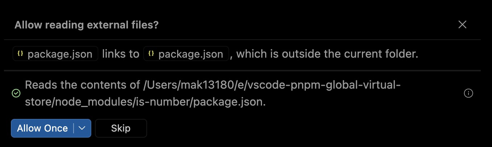

# VSCode Copilot read access to pnpm global virtual store

PNPM supports [virtualStoreType: global](https://pnpm.io/settings/node-modules#virtualstoretype), which stores `node_modules` dependencies as symlinks in a global directory, outside the project directory.

This causes VSCode Copilot to ask for `node_modules` read permission each time a new session is started.

## Reproduction

Ensure pnpm 12 is installed.

1. Clone this repository

   ```sh
   git clone https://github.com/maxpatiiuk/vscode-pnpm-global-virtual-store/
   cd vscode-pnpm-global-virtual-store
   ```

2. Install dependencies using pnpm

   ```sh
   pnpm install
   ```

3. Ask Copilot to read inside node_modules:

   > List contents of the node_modules/is-number/package.json file

   You get a permission prompt:

   

## Workarounds

Ideally virtual global store is supported without additional config.

However, I wasn't able to get rid of permission prompt even after setting `github.copilot.chat.additionalReadAccessPaths` VSCode setting (see [.vscode/settings.json](./.vscode/settings.json)). Tried both in user and workspace config. Restarted VSCode.

## VSCode Version

```yaml
Version: 1.139.1
Commit: 04c0d99f4fb0d8afe6ce4f0c58e31e183ac3e4b1
Date: 2026-09-25T03:40:57Z
Electron: 43.6.0
ElectronBuildId: 15274685
Chromium: 150.0.7871.250
Node.js: 24.20.0
V8: 15.0.245.31-electron.0
@github/copilot: 1.0.85.r35379093703.g3514c9a
@github/copilot-sdk: 1.0.15.35393089353.gfc44743
OS: Darwin arm64 25.6.0
```
